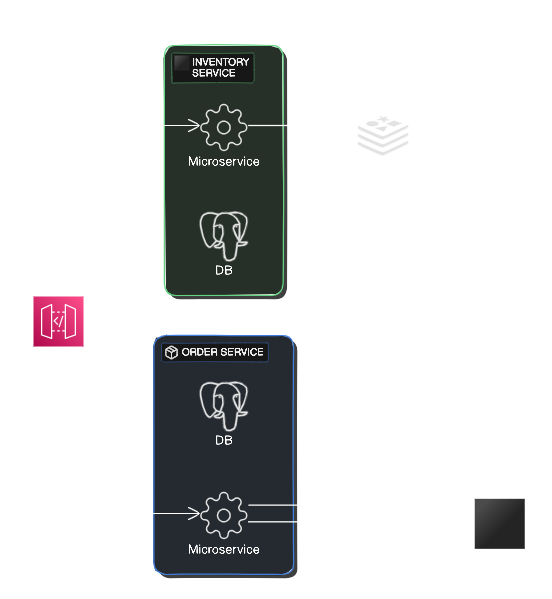

# Application Documentation

This application is structured as a microservices architecture, consisting of three core components:


1. **API Gateway**: The main entry point for client requests, responsible for routing to the appropriate services.
2. **Orders Microservice**: Manages order creation, processing, and coordination with inventory.
3. **Inventory Microservice**: Maintains inventory details and ensures availability checks for order processing.

## Getting Started

### 1. Build and Start the Application
To initialize and run all services together, use Docker Compose:
```bash
docker-compose up --build
```
### 2. Running unit tests
To run the unit tests, first make the test script executable:
```bash
chmod +x ./runtests.sh
```
Then execute the script to run all tests:
```bash
./runtests.sh
```

### 3. API Endpoints
To view the API documentation, navigate to http://localhost:3000/api-docs/.